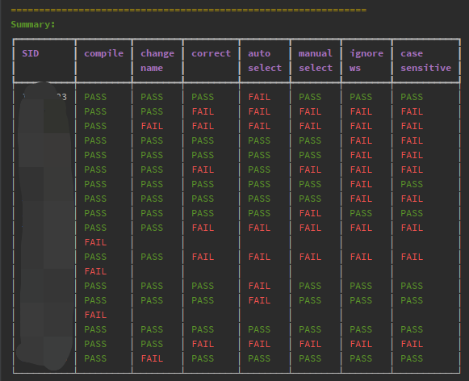

# Assignment Judger for C/C++ CS205 Spring2021 @SUSTech



### Prerequisite

1. Environment
    - Linux System (or pycharm remote) with clang/g++ compiler
    - python > 3.7

2. Dependencies
    ```
    pip install rich
    ```

3. Put students' cpp files into `A2/assignments` (Don't forget to change the name into SID!)

4. `python judge_a2.py`
